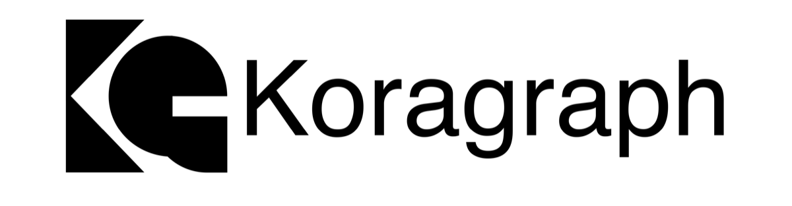
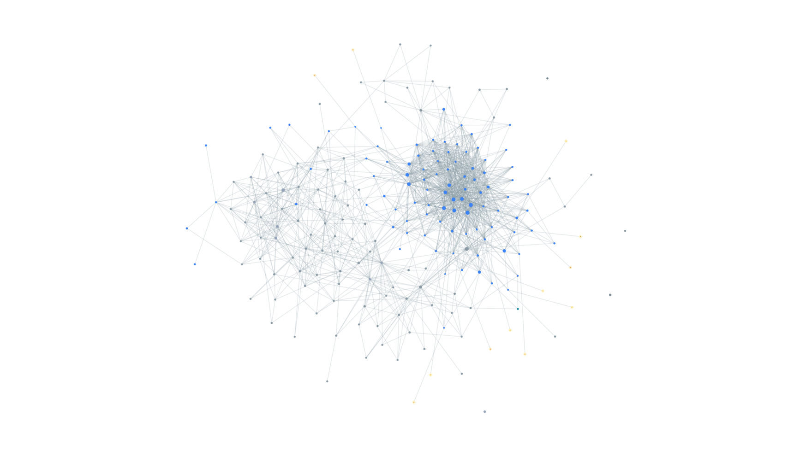

<div align="center">

# koragraph

**A local, multi-repo code graph for your coding agent.**

[](LICENSE)
[](package.json)
[](#tools)
[](https://www.koragraph.in/)



</div>

Point it at the repos you work on. koragraph reads them with tree-sitter, resolves calls, imports,
inheritance, and cross-service edges, mines git history for what changes together, and remembers
what you teach it. All local. No LLM, no cloud, no tokens.

---

## See it

Two planes, drawn together. Run `koragraph serve` for the whole repository's backbone,
or `koragraph serve --focus <symbol>` for one symbol's neighbourhood, and open the local page it prints:

<div align="center">

</div>

The cool nodes are your **code** — declarations, and the calls, imports and cross-repo edges between
them. The gold diamonds are koragraph's **memory** — the hazards, rules and corrections it has
learned, each linked to the exact declaration it is about. One self-contained page, rendered
locally; no network, no external assets.

---

## Memory

koragraph anchors facts to the **declaration** they're about, in a durable SQLite store
(`~/.koragraph/practice.db`). Rename the code, the fact follows. Delete it, the fact orphans. No
`CLAUDE.md` to maintain by hand.

Already have a `CLAUDE.md` or `AGENTS.md`? Tell any coding agent:

> Read [`KORAINIT.md`](KORAINIT.md) and follow it.

It imports your instructions into memory, flags rules that reference code that's already gone, and
supersedes rather than duplicates on a re-run.

---

## Tools

Nine MCP tools. Every one returns `file:line`, not pasted source. `detail: concise | full` on
every call, concise by default. One tool writes.

| Tool | What it's for |
|---|---|
| **`explore`** | Symbol or plain English. Ranked declarations plus source, callers, callees. |
| **`blast_radius`** | Run before editing. What depends on this, and what has no test coverage. |
| `search_code` | Locate a name in the graph, not raw text. |
| `neighbours` | Callers and callees of one symbol. |
| `changes_with` | What has historically changed together with a symbol. |
| `file_symbols` | Declarations in one file. |
| `overview` | Orient on the first turn. Store level index across repos. |
| `recall` | A failed attempt and its fix, a hazard, a revert. |
| `remember` | Save a durable, code anchored fact. The only writer. |

---

## Graph

Your services aren't one repo. koragraph resolves the edges between them, structurally, no LLM:

- **HTTP calls.** A client call with a literal URL — `fetch`, `axios`, `requests`, `net/http`,
  `HttpClient`, `reqwest`, `Guzzle`, and the rest, across all supported languages — resolves to the
  `ENDPOINT` it targets in another repo, as a real `CALLS` edge.
- **gRPC and `.proto`.** A service to the stubs that call it, across repos.
- **Published packages.** An import resolves to the exporting repo's symbol. Solid for ES imports;
  CommonJS resolves file level for now.
- **Message topics.** Producer to consumer, including topic names bound to env vars.
- **Infra wiring.** `docker-compose.yml` and `.env` become `SERVICE`, `DEPENDS_ON`, `USES_CONFIG`.
  Framework routes become `ENDPOINT` and `HANDLED_BY`.

**Co-change.** Git history mined at the function level: this function changes with that function.
Surfaces in `blast_radius` and `changes_with`.

**Runtime tracing.** `koragraph trace <path> -- <cmd>` runs your tests under `sys.setprofile` and
folds real calls into the graph, tagged `[runtime-confirmed]`. Python today.

**Local.** No model in the loop. Ingest the same repo twice, get the same graph.

---

## Quickstart

Node ≥ 22.

```bash
npm install -g koragraphmcp
koragraph ingest /path/to/repo
koragraph doctor          # prints the exact line to wire into your editor
```

Connect it to Claude Code — `-s user` makes it available in every project:

```bash
claude mcp add koragraph -s user -- koragraph mcp
```

The store creates itself on first open: one SQLite file at `~/.koragraph/graph.db`. No server, no config.

### Or hand it to your agent

Paste this into any coding agent (Claude Code, Cursor, Copilot), from the repo you want indexed:

```text
Install koragraph and set it up for this repo, then report back:
1. npm install -g koragraphmcp
2. koragraph ingest .
3. koragraph doctor — then run the `claude mcp add …` line it prints (or, if I'm not on Claude
   Code, wire `koragraph mcp` into my editor's MCP config).
4. Find KORAINIT.md in the installed package (`npm root -g`, then koragraphmcp/KORAINIT.md) and
   follow it — it imports my existing CLAUDE.md / AGENTS.md into memory, verified against the code.
Report: nodes/edges indexed, whether the MCP connected, and KORAINIT's summary.
```

---

## Languages

**12 main languages**, tree-sitter throughout, more in progress:

`c` · `c++` · `c#` · `go` · `java` · `javascript` · `php` · `python` · `ruby` · `rust` · `swift` ·
`typescript / tsx`

---

## Accuracy

**The most accurate local code graph.** Across all 12 languages — 3 pinned repositories each, every
graph scored by an **independent compiler front-end** (CPython `ast`, `go/parser`, Roslyn, `syn`,
`tsc`, Ripper, php-ast, ctags, `swiftc`), not the tool under test — koragraph **wins 34 of 39
language×plane cells** against **CodeGraph**, **GitNexus** and **Graphify**.

| Plane | koragraph leads |
|---|---|
| Declarations | 10 / 12 languages |
| Imports | 7 / 9 |
| Inheritance | **9 / 9** |
| Calls | 8 / 9 |

Call resolution holds **91–100% precision on every language**; where a competitor shows higher raw
recall it is by over-emitting (CodeGraph reports **zero** Rust imports, and PHP imports at 57–72%
precision). No LLM, no cloud — every number reproduces from
[`test/benchmark`](test/benchmark) with a pinned corpus, pinned competitor versions and pinned
oracles. Full per-language breakdown: [`test/benchmark/REPORT.md`](test/benchmark/REPORT.md).

---

## The CLI

Every command is `koragraph <command>`:

| Command | Does |
|---|---|
| `ingest <path...>` | Index one or more repos (`--watch` supported) |
| `status` | What's in the graph, and when |
| `report` | Markdown snapshot (also mermaid, graphml, dot, json, cypher) |
| `serve` | Open an interactive picture of the graph in your browser (local, no network) |
| `doctor` | End to end install check with a named remedy |
| `cochange <symbol>` | What has historically changed with a symbol |
| `diff` | What appeared or disappeared in the last re-index |
| `trace <path> -- <cmd>` | Fold real calls into the graph (Python) |
| `hooks` | Auto re-index on commit and checkout |
| `practice <verb>` | Inspect, correct, maintain memory |
| `mcp` | Serve the graph over MCP on stdio |

---

## How it works

1. **Walk** the repos, honouring `.gitignore`.
2. **Extract** declarations with tree-sitter.
3. **Resolve** calls, imports, inheritance, cross-service edges.
4. **Mine** git history, optionally fold in runtime calls.
5. **Serve** it all over MCP, locally.

Re-indexing after a commit is **incremental** — only the files that changed since the last indexed
commit are re-extracted and re-resolved, and a changed file's calls still resolve against the whole
graph. Already-correct edges are left untouched. Two planes settle a little after the graph is
queryable: co-change is mined in a background process, and a call that was previously ambiguous
between several declarations is only reconsidered once its own file changes. `koragraph ingest
--full` re-resolves everything from scratch and sweeps both up — worth running after a large
refactor, or on a schedule.

---

## Requirements & status

- **Node ≥ 22.**
- Pure local tooling: better-sqlite3, tree-sitter. No LLM, no embedding dependency — no code on the
  shipping path imports a model-provider SDK, calls a model, or touches the network. (A few columns
  and code seams exist for an optional summarizer you could wire yourself; this distribution never
  runs one, and summaries are derived structurally.)
- **On npm.** `npm install -g koragraphmcp`.

## License

[BUSL-1.1](LICENSE), free to use including at work. No commercial hosted or managed offering of
koragraph itself. Converts to Apache-2.0 on the change date.
