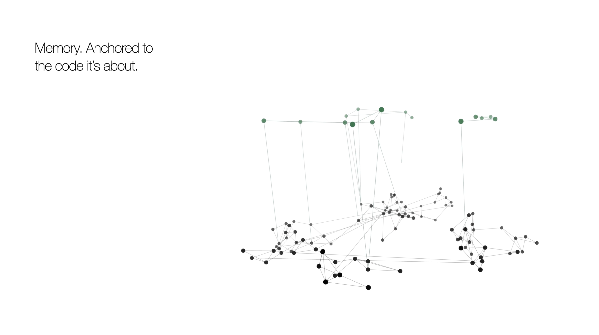

<div align="center">


# The ultimate context layer for your AI coding agent.

**Completely free. Runs entirely on your machine.**

A local knowledge graph of every repo you point it at, plus a memory layer
that knows when the code it remembers has changed.

[](https://www.npmjs.com/package/koragraphmcp)
[](LICENSE)
[](package.json)
[](#the-tools)
[](https://www.koragraph.in/)

</div>

## Install

```bash
npm install -g koragraphmcp
koragraph ingest /path/to/repo        # point it at as many repos as you like
claude mcp add koragraph -s user -- koragraph mcp
```

`koragraph doctor` checks the whole chain and prints the exact line for any editor.

### Then run KORAINIT in your editor

This is the step that lights up the memory layer, so don't skip it. In your coding agent (Claude
Code, Cursor, Windsurf, whatever you use), tell it:

> ### "Read `KORAINIT.md` and follow it."

It imports your existing `CLAUDE.md` / `AGENTS.md` into koragraph's memory, anchored to the code
each rule is about, flags any rule that points at code that's already gone, and finishes wiring
koragraph into the session. Run it once per project.

**Prefer zero setup?** Hand the whole thing to your agent instead. Paste this from the repo you
want indexed, and it installs, indexes, wires itself in, and runs KORAINIT for you:

```text
Install koragraph and set it up for this repo, then report back:
1. npm install -g koragraphmcp
2. koragraph ingest .
3. koragraph doctor, then run the `claude mcp add …` line it prints (or wire `koragraph mcp` into
   my editor's MCP config).
4. Find KORAINIT.md in the installed package (`npm root -g`, then koragraphmcp/KORAINIT.md) and
   follow it: it imports my existing CLAUDE.md / AGENTS.md into memory, verified against the code.
Report: nodes/edges indexed, whether the MCP connected, and KORAINIT's summary.
```

<div align="center">
<br><strong>Works with</strong><br><br>
&nbsp;&nbsp;&nbsp;
&nbsp;&nbsp;&nbsp;
&nbsp;&nbsp;&nbsp;
&nbsp;&nbsp;&nbsp;
&nbsp;&nbsp;&nbsp;
&nbsp;&nbsp;&nbsp;
&nbsp;&nbsp;&nbsp;
&nbsp;&nbsp;&nbsp;
&nbsp;&nbsp;&nbsp;

</div>

---

## One map of everything you've built

Koragraph turns every repo you point it at into **one live graph**: a resolved structure, with an
edge only where there really is one.

- Every service, file, endpoint, and table.
- The real calls between them, resolved against the syntax tree, not guessed by name.
- The edges that **cross a repo boundary**, where single-repo tools go quiet.

<div align="center">

<br><em><code>koragraph serve</code>: code (cool nodes) and its memory (gold diamonds), one local page.</em>
</div>

---

## A memory that knows when the code changed

Everything your agent learns is saved locally, **anchored to the exact declaration**, not a line
number. Rename the code and the fact follows; delete it and the fact retires. No `CLAUDE.md` to
maintain, and it survives every upgrade.

- **Failures and their fixes.** The fix surfaces before you hit the same wall twice.
- **Hazards, rules, corrections.** Stated once, honoured every session after.
- **The "let's push this to Wednesday."** Deferrals and half-finished intent, parked against the
  code and surfaced the moment you're back.

<div align="center">

</div>

---

## Measurably the most accurate, scored by the compilers

Every graph is graded by an **independent compiler front-end** (CPython `ast`, `go/parser`, Roslyn,
`syn`, `tsc`, Ripper, php-ast, ctags, `swiftc`), never the tool under test. koragraph **wins 34 of
39 language×plane cells, and leads precision on all 39.**

Call-graph recall, the hardest plane:

| Language | koragraph | CodeGraph | GitNexus | Graphify |
|---|:--:|:--:|:--:|:--:|
| JavaScript | **87.6** | 39.4 | 41.9 | 45.1 |
| TypeScript | **70.6** | 55.2 | 50.2 | 44.2 |
| Python | **86.1** | 85.1 | 54.6 | 53.3 |
| Go | **89.1** | 85.0 | 63.8 | 65.3 |
| Java | **86.0** | 73.1 | 68.6 | 53.5 |
| C# | **83.6** | 79.8 | 50.5 | 54.4 |
| PHP | **88.9** | 88.0 | 77.1 | 31.7 |
| Ruby | **51.5** | 41.3 | 28.7 | 40.8 |
| Rust | 68.7 | 76.5 | 48.9 | 47.6 |

Reproduces from [`test/benchmark`](test/benchmark): pinned corpus, pinned competitor versions,
pinned oracles. Full breakdown in [`test/benchmark/REPORT.md`](test/benchmark/REPORT.md).

---

## The tools

Nine MCP tools. Every one returns `file:line`, never pasted source. Exactly one writes.

| Tool | What it's for |
|---|---|
| **`blast_radius`** | Run before editing. Everything that depends on this, across repos, and what has no test coverage. |
| **`explore`** | A symbol or plain English gives you ranked declarations, source, callers, callees. |
| `search_code` | Find a name in the graph, not raw text. |
| `neighbours` | Callers and callees of one symbol. |
| `changes_with` | What has historically shipped together with a symbol. |
| `file_symbols` | Declarations in one file. |
| `overview` | Orient on turn one, across every repo. |
| `recall` | A past failure and its fix, a hazard, an open loop. |
| `remember` | Save a durable, code-anchored fact. The only writer. |

Plus a CLI: `ingest`, `serve`, `status`, `doctor`, `diff`, `trace`, `hooks`, `practice`, `report`.

---

## Languages

`c` · `c++` · `c#` · `go` · `java` · `javascript` · `php` · `python` · `ruby` · `rust` · `swift` ·
`typescript / tsx`, fully resolved, tree-sitter throughout. Plus experimental `kotlin` · `scala` ·
`elixir` · `solidity` · `vue` · `zig` · `objective-c` · `ocaml` · `rescript`.

---

## License

[BUSL-1.1](LICENSE). Free to use, including at work. Converts to Apache-2.0 on the change date.

<div align="center"><br><sub>Built by Akhil Katakam · Ethan Faleiro &nbsp;·&nbsp; founders@koragraph.in</sub></div>
